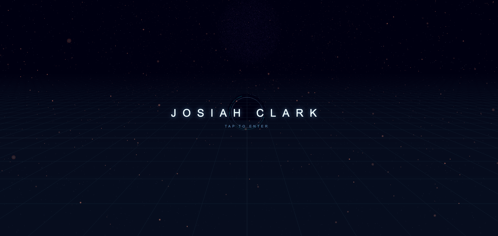
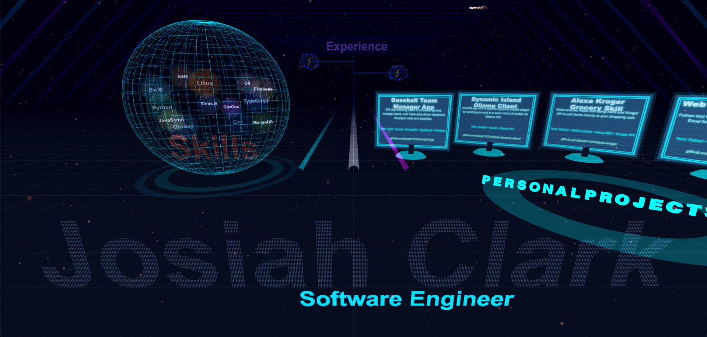

# 3D Personal Portfolio | Josiah Clark

A high-performance, interactive 3D portfolio built with **Three.js** and **Vite**. This project features a custom-engineered "Portal" landing page, interactive physics-based elements, and a neon-aesthetic navigation system.

**Live Demo:** [josiahclark.com](https://josiahclark.com)

---

## Features

* **Interactive Landing Portal:** A custom-coded 3D entrance using circular geometry and TWEEN.js animations.
* **Neon Tunnel Navigation:** Procedural geometry and emissive materials creating a futuristic traversal experience.
* **Dynamic Particles & Glow Text:** Custom particle systems that react to user interaction.
* **Responsive 3D Design:** Fully optimized for both desktop and mobile browsers.
* **Automated CI/CD:** Integrated GitHub Actions pipeline for automated testing and deployment to a custom domain.


---

## Tech Stack

* **Engine:** [Three.js](https://threejs.org/) (WebGL)
* **Build Tool:** [Vite](https://vitejs.dev/)
* **Animations:** [@tweenjs/tween.js](https://github.com/tweenjs/tween.js)
* **Testing:** [Vitest](https://vitest.dev/) & [JSDOM](https://github.com/jsdom/jsdom)
* **Deployment:** GitHub Pages + GoDaddy DNS

---

## Installation & Setup

To run this project locally, ensure you have [Node.js](https://nodejs.org/) installed.

1. **Clone the repository:**
   ```bash
   git clone https://github.com/josiah1121/3DPersonalPortfolio.git
   cd 3DPersonalPortfolio
   ```
2. **Install dependencies**
    ```
    npm install
    ```
3. **Run the development server**
    ```
    npm run dev
    ```
4. **Run the test suite**
    ```
    npm test
    ```

## CI/CD Workflow

This project utilizes a robust GitHub Actions pipeline (`ci.yaml`) that ensures code quality and automated delivery:

1.  **System Dependencies:** Installs essential canvas dependencies (`libcairo2-dev`, `libpango1.0-dev`, etc.) to support headless 3D testing.
2.  **Automated Testing:** Runs a suite of **86 unit tests** using Vitest, covering scene initialization, geometry creation, and UI logic.
3.  **Production Build:** Bundles and minifies assets using **Vite** for optimal performance on the live domain.
4.  **Continuous Deployment:** Automatically deploys the latest build to [josiahclark.com](https://josiahclark.com) only when changes are successfully merged into the `main` branch.


---

## License

This project is licensed under the **MIT License** - see the [LICENSE](LICENSE) file for details.

---

## Contact

**Josiah Clark** 
* GitHub: [@josiah1121](https://github.com/josiah1121)
* Portfolio: [josiahclark.com](https://josiahclark.com)

---

**Screenshots:** 

